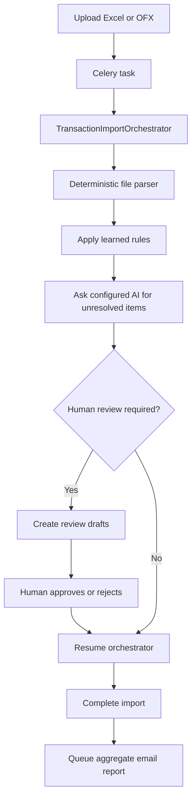

# Django Simple Finance

A multi-user personal finance REST API built with Django and Django REST Framework. The project manages accounts, categories, transactions, suppliers, and asynchronous transaction imports from Excel and OFX files.

The main engineering focus is the transaction import pipeline: an uploaded file is registered as an import, queued with Celery, routed to the appropriate processor, validated, and converted into user-owned financial records while its progress is tracked by the API.

## Highlights

- Token-based authentication and user profile management
- Per-user data isolation for financial resources
- Account, category, transaction, and supplier APIs
- Filtering, search, ordering, and financial summaries
- Asynchronous Excel and OFX imports with Celery and Redis
- Extensible processor architecture using Strategy and Factory patterns
- Import status and progress tracking
- OpenAPI schema with Swagger UI and ReDoc
- Structured application logging with Loguru
- Automated API and processor tests with pytest
- Human-reviewed transaction categorization with reusable learned rules
- Provider-neutral AI categorization contract with no vendor lock-in
- Retryable, duplicate-aware aggregate reports by email

## Import architecture



`finances/transaction_imports/orchestrator.py` is the walkthrough entry point.
It contains the complete business sequence in five numbered steps: parsing,
learned rules, AI fallback, human routing, and completion with email. The Celery
task only starts this use case. File parsing, AI providers, and email delivery
remain replaceable implementation details.

The `TransactionProcessor` interface keeps file-specific parsing separate from
the workflow. `ProcessorFactory` selects an implementation from the uploaded
file extension without changing the orchestrator.

## Assisted categorization

OFX transactions first try a rule previously confirmed by the user. A known
description is categorized automatically. An unknown description becomes a
draft in `AWAITING_REVIEW`; a future AI adapter can suggest a category, but the
transaction is only created after the user approves or corrects it.

Approving with `remember_choice=true` stores a normalized description rule.
For example, both `UBER *TRIP 8392` and `UBER *TRIP 1044` normalize to
`uber trip` and reuse the same category. Learned rules can be edited or deleted
through `/api/finances/transaction-category-rules/`.

The provider boundary is `CategorizationProvider` in
`finances/categorization/contracts.py`. It receives provider-neutral
`CategorizationCandidate` and `CategoryOption` objects and must return
structured `CategorizationSuggestion` objects. The default adapter makes no
external calls:

```env
AI_CATEGORIZATION_PROVIDER=finances.categorization.providers.NullCategorizationProvider
```

To add Gemini, Grok, Anthropic, or another provider, implement that interface
in a separate adapter and change only this import path. The application layer
validates references, category ownership, and confidence before accepting a
suggestion.

Review endpoints:

- `GET /api/finances/transaction-import-items/?review_status=PENDING_REVIEW`
- `POST /api/finances/transaction-import-items/{id}/approve/`
- `POST /api/finances/transaction-import-items/{id}/reject/`
- `GET/PATCH/DELETE /api/finances/transaction-category-rules/{id}/`

## Import report email

An import with no pending review is completed and queues a transactional email.
If human review is required, the same orchestrator resumes after the last item
is approved or rejected, then queues the report. The email contains only
aggregate counts and totals; transaction descriptions stay out of the inbox.

Delivery is a separate Celery task with exponential retry. The import stores
the delivery state, attempt count, error, and sent timestamp. A deterministic
`X-Idempotency-Key` prevents duplicate sends when the configured backend
supports idempotency.

Local development prints emails to the console:

```env
EMAIL_BACKEND=django.core.mail.backends.console.EmailBackend
DEFAULT_FROM_EMAIL="Django Simple Finance <finance@example.com>"
SUPPORT_EMAIL=support@example.com
```

Production can use SMTP, SES, or another Django email backend. Configure SPF,
DKIM, and DMARC for the sending domain before sending real email.

## Technology stack

- Python
- Django 4.2
- Django REST Framework
- Celery 5
- Redis
- SQLite for local development; PostgreSQL-compatible configuration through `DATABASE_URL`
- pandas and openpyxl for Excel processing
- ofxparse for OFX processing
- drf-spectacular for OpenAPI documentation
- pytest and pytest-django
- Loguru and Google Cloud Logging

## Project structure

```text
business_suppliers/              Supplier and supplier-transaction APIs
core/                            Django settings, URLs, Celery and logging
finances/
  accounts/                      Account API
  categories/                    Category API
  transactions/                  Transaction and reporting APIs
  transaction_imports/
    orchestrator.py              Complete import business workflow
    processors/                  Strategy implementations and factory
    report_email_service.py      Aggregate transactional email
    tasks.py                     Thin Celery entry points and retry policy
    transaction_import_views.py Upload, processing and template endpoints
identity/                        Registration, authentication and profiles
```

## Local setup

### Prerequisites

- Python 3.9–3.11 with the current dependency set
- Docker with Docker Compose, or a local Redis server

Clone the repository and create a virtual environment:

```bash
git clone https://github.com/caiomoura1994/django-simple-finance.git
cd django-simple-finance

python3 -m venv .venv
source .venv/bin/activate
python -m pip install --upgrade pip
python -m pip install "numpy<2" -r requirements_dev.txt
```

Apply the database migrations:

```bash
python manage.py migrate
```

Start Redis:

```bash
docker compose up -d redis
```

Configure Celery to reach Redis through the host port:

```bash
export CELERY_BROKER_URL=redis://localhost:6379/0
export CELERY_RESULT_BACKEND=redis://localhost:6379/0
```

Start the API:

```bash
python manage.py runserver
```

In another terminal, activate the virtual environment, export the same Celery variables, and start a worker:

```bash
source .venv/bin/activate
export CELERY_BROKER_URL=redis://localhost:6379/0
export CELERY_RESULT_BACKEND=redis://localhost:6379/0
celery -A core worker --loglevel=info
```

## API documentation

With the development server running:

- Swagger UI: <http://127.0.0.1:8000/api/docs/>
- ReDoc: <http://127.0.0.1:8000/api/redoc/>
- OpenAPI schema: <http://127.0.0.1:8000/api/schema/>

Protected endpoints accept a Django REST Framework token:

```http
Authorization: Token <your-token>
```

The main API groups are:

- `/api/auth/` — registration, login, profile, password change, and logout
- `/api/finances/accounts/` — accounts and balance adjustments
- `/api/finances/categories/` — transaction categories
- `/api/finances/transactions/` — transactions and financial summaries
- `/api/finances/transaction-imports/` — file uploads, processing, and import status
- `/api/suppliers/` — suppliers and related transactions

## Excel import format

An Excel import requires these columns:

| Column | Example | Description |
| --- | --- | --- |
| `date` | `2026-09-20` | Transaction date |
| `description` | `Grocery store` | Human-readable description |
| `amount` | `150.75` | Positive monetary amount |
| `kind_of_transaction` | `EXPENSE` | `INCOME` or `EXPENSE` |
| `category` | `Food` | Category name |
| `account` | `Main Account` | Account name |

A ready-to-use spreadsheet can also be generated through the transaction-import template endpoint exposed in Swagger UI.

## Running the tests

```bash
pytest
```

The suite covers authentication, account and category operations, transaction summaries, ownership validation, Excel/OFX processing, processor selection, file uploads, and asynchronous import dispatch.

To run a focused part of the suite:

```bash
pytest finances/transaction_imports/
```

## Design considerations

- Every primary finance model belongs to a user, and API querysets are scoped to the authenticated owner.
- File parsing is selected through a factory instead of branching inside the task.
- Imports are processed outside the request-response cycle so larger files do not block an API worker.
- Import records expose status, item counts, task IDs, and error information for operational visibility.
- SQLite keeps local setup lightweight, while `DATABASE_URL` allows a production database such as PostgreSQL.

## Production hardening

Before operating the project as a production financial system, the next priorities would be:

- make import dispatch idempotent and prevent duplicate processing;
- claim imports atomically before queueing and enforce valid status transitions;
- use database transactions and batch inserts for all-or-nothing imports;
- preserve OFX transaction identifiers and detect duplicates;
- validate file size, content type, extension, and source consistency;
- normalize imported datetimes into timezone-aware values;
- move uploaded files to durable object storage;
- add retry policies, dead-letter handling, metrics, and alerts;
- configure production security settings and secret management.
